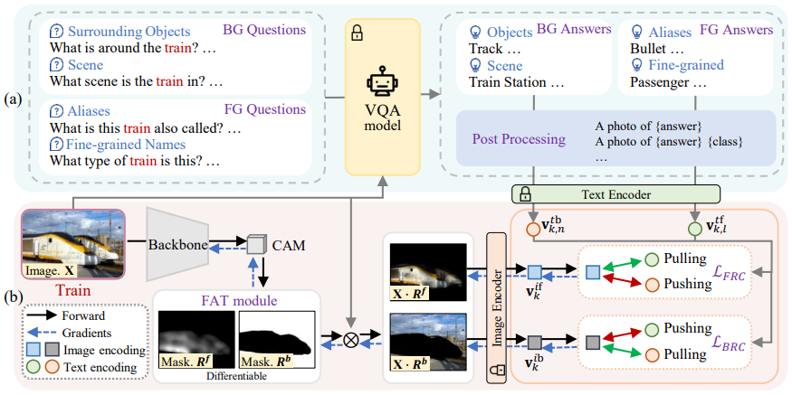

# [MM'23] QA-CLIMS

This is the official PyTorch implementation of our paper:

> **QA-CLIMS: Question-Answer Cross Language Image Matching for Weakly Supervised Semantic Segmentation** <br>
> [Songhe Deng](https://github.com/Tiiiktak), [Wei Zhuo](), [Jinheng Xie](https://github.com/Sierkinhane), [Linlin Shen](https://scholar.google.com/citations?user=AZ_y9HgAAAAJ) <br>
> Computer Vision Institute, Shenzhen University<br>
> ACM International Conference on Multimedia, 2023 <br>
> [[Paper]](https://dl.acm.org/doi/10.1145/3581783.3612148) [[Arxiv]](https://arxiv.org/abs/2401.09883)



## Environment

- Python 3.7
- PyTorch 1.7.1
- torchvision 0.8.2

```shell
pip install -r requirements.txt
```

## PASCAL VOC2012

You can find the following files at [here](https://drive.google.com/drive/folders/1U79Lmp-ufajPCUG7jAVyk924f9YmQSsA?usp=drive_link)

| File                       | filename                                                                       |
|:---------------------------|:-------------------------------------------------------------------------------|
| FG & BG VQA results        | `voc_vqa_fg_blip.npy` <br> `voc_vqa_bg_blip.npy`                               | 
| FG & BG VQA text features  | `voc_vqa_fg_blip_ViT-L-14_cache.npy` <br> `voc_vqa_bg_blip_ViT-L-14_cache.npy` |
| pre-trained baseline model | `res50_cam.pth`                                                                |
| QA-CLIMS model             | `res50_qa_clims.pth`                                                           |


### 1. Prepare VQA result features

You can download the VQA text features `voc_vqa_fg_blip_ViT-L-14_cache.npy` and `voc_vqa_bg_blip_ViT-L-14_cache.npy` above 
and put its in `vqa/`.

<details>
<summary>Or, you can generate it by yourself:</summary>

To generate VQA results, please follow [third_party/README](third_party/README.md#BLIP).

After that, run following command to generate VQA text features:

```shell
python tools/gen_text_feats_cache.py voc \
    --vqa_fg_file vqa/voc_vqa_fg_blip.npy \
    --vqa_fg_cache_file vqa/voc_vqa_fg_blip_ViT-L-14_cache.npy \
    --vqa_bg_file vqa/voc_vqa_bg_blip.npy \
    --vqa_bg_cache_file vqa/voc_vqa_bg_blip_ViT-L-14_cache.npy \
    --clip ViT-L/14
```

</details>


### 2. Train QA-CLIMS and generate initial CAMs

Please download the pre-trained baseline model `res50_cam.pth` above and put it at `cam-baseline-voc12/res50_cam.pth`.

```shell
bash run_voc12_qa_clims.sh
```

### 3. Train IRNet and generate pseudo semantic masks

```shell
bash run_voc12_sem_seg.sh
```

### 4.Train DeepLab using pseudo semantic masks. 

Please follow [deeplab-pytorch](https://github.com/kazuto1011/deeplab-pytorch) or [CLIMS](https://github.com/CVI-SZU/CLIMS/tree/master/segmentation/deeplabv2).

## MS COCO2014

Comming soon...


## Citation

If you find this code useful for your research, please consider cite our paper:

```
@inproceedings{deng2023qa-clims,
  title={QA-CLIMS: Question-Answer Cross Language Image Matching for Weakly Supervised Semantic Segmentation},
  author={Deng, Songhe and Zhuo, Wei and Xie, Jinheng and Shen, Linlin},
  booktitle={Proceedings of the 31st ACM International Conference on Multimedia},
  pages={5572--5583},
  year={2023}
}
```


---

This repository was highly based on [CLIMS](https://github.com/CVI-SZU/CLIMS) and [IRNet](https://github.com/jiwoon-ahn/irn), thanks for their great works!